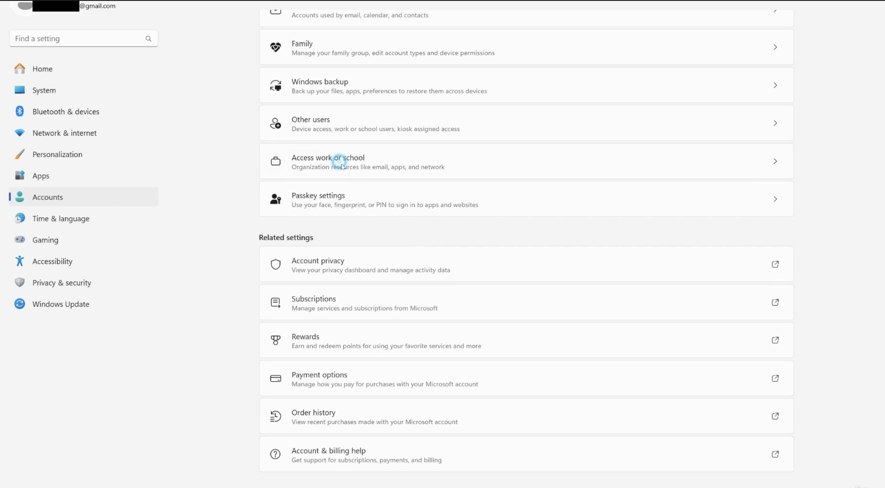
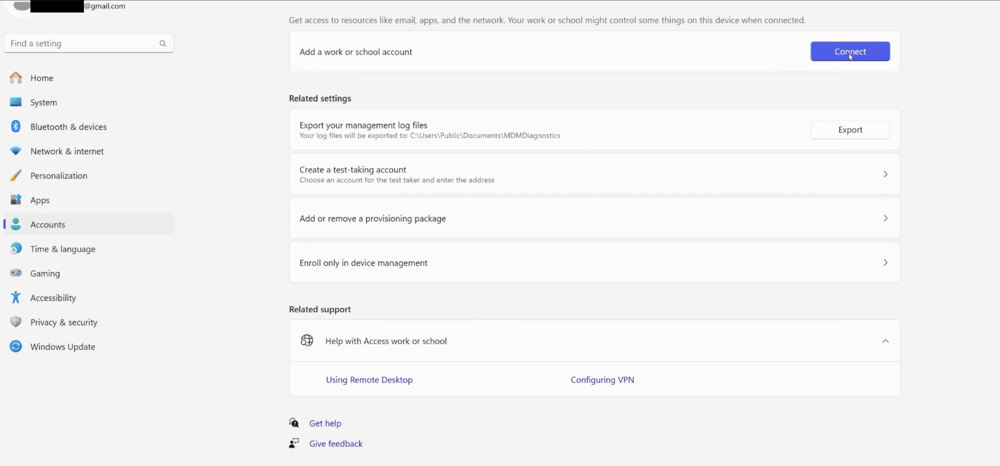
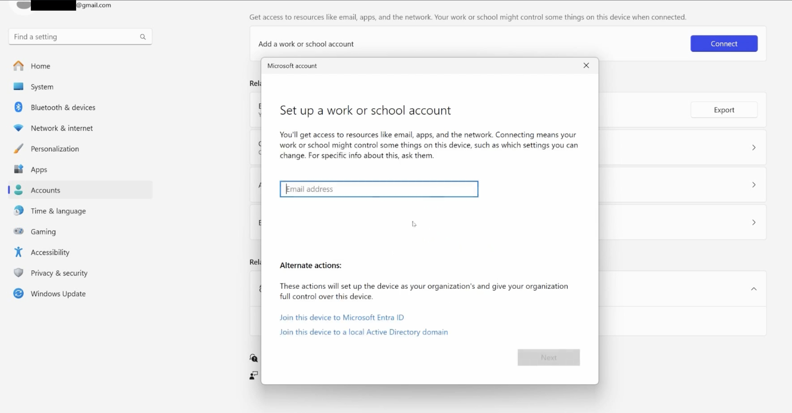
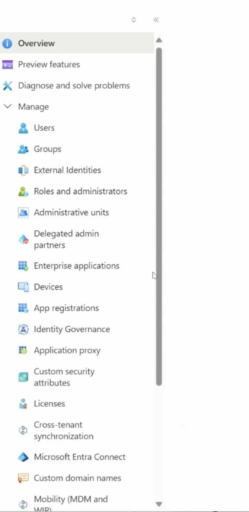
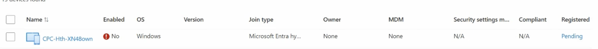

# Microsoft Entra ID Device Notes

### I  started to study for md-102 certification exam yesterday. I will keep updating this readme file as long as I'm preparing for exam.
### The PowerShell repository I made yesterday is also useful for md-102 exam.
### Should you have any questions, feel free to contact me pouya.ecn@gmail.com

---

## Why do we add devices to Microsoft Entra ID?

Devices are added or registered in Microsoft Entra ID so organizations can control and secure access to company resources.

Example:

If an employee uses a personal laptop for work, this is called BYOD, or Bring Your Own Device.

The employee can still sign in to the laptop with a local account or personal account. However, when they want to access company resources like Microsoft 365, Teams, SharePoint, OneDrive, or work apps, they must use their Microsoft Entra ID work account.

This helps the company apply security rules and protect company data.

Examples of what Entra ID can help with:

- Single Sign-On (SSO)
- Conditional Access
- Passwordless sign-in with Microsoft Authenticator
- Controlling access to company apps and resources
- Working with Intune to check whether a device is compliant

Important:

Microsoft Entra ID is mainly for identity and access management.

Microsoft Intune is mainly for device management, app management, and compliance.

## Main device types

There are two important device types:

1. Microsoft Entra Registered
2. Microsoft Entra Joined

## Microsoft Entra Registered

Microsoft Entra Registered devices are usually personal devices.

This is common in BYOD scenarios.

The user signs in to the device with a personal or local account, but signs in to company resources with their Entra ID work account.

Examples:

- Personal laptop
- Personal phone
- Personal tablet

This gives the company some control over access to company data, but the device is still personal.

## Microsoft Entra Joined

Microsoft Entra Joined devices are usually company-owned devices.

In this case, the user signs in to Windows itself using their Microsoft Entra ID work account.

Example:

The company gives a laptop to an employee. The employee turns it on and signs in with their work email and password.

This type gives the company more control over the device.

Important:

Microsoft Entra Join is mainly for Windows 10 and Windows 11, except Home editions.

Windows Home edition does not support Entra Join.

## Entra Registered vs Entra Joined

Entra Registered:

- Usually BYOD
- Usually personal device
- User signs in to the device with a personal/local account
- User signs in to company resources with Entra ID
- Less company control

Entra Joined:

- Usually company-owned device
- User signs in to Windows with Entra ID
- Usually managed by Intune
- More company control

## How to configure devices

Windows 10/11:

Settings > Accounts > Access work or school

iOS and Android:

- Microsoft Intune Company Portal
- Microsoft Authenticator

macOS:

- Microsoft Intune Company Portal

Linux:

- Microsoft Intune-supported enrollment method or Intune agent, depending on support

## MDM and MAM

There are two important concepts:

1. MDM
2. MAM

## MDM: Mobile Device Management

MDM means managing the whole device.

Microsoft Intune is an example of MDM.

With MDM, the company can:

- Configure device settings
- Require password or PIN
- Require encryption
- Install apps
- Check compliance
- Manage updates
- Wipe company data or the whole device if needed

## MAM: Mobile Application Management

MAM means managing apps, not the whole device.

This is useful for BYOD.

With MAM, the company can:

- Protect company data inside apps
- Block copy/paste from work apps to personal apps
- Require PIN for work apps
- Remove company data from apps without wiping the whole device

## Conditional Access and Intune

Conditional Access is configured in Microsoft Entra ID.

Intune can report whether a device is compliant.

Example:

A company can create a rule that says:

Only allow access to company resources if the device is compliant.

A compliant device may mean:

- Enrolled in Intune
- Password or PIN enabled
- Encryption enabled
- Not rooted or jailbroken
- Meets company security requirements

## Provisioning Entra Joined Devices

Provisioning means preparing a device for work use.

For Entra Joined devices, this can happen in different ways.

## OOBE

OOBE means Out-of-Box Experience.

This is the setup screen when a new Windows device is turned on for the first time.

During setup, the user can sign in with a work account, and the device can join Microsoft Entra ID.

## Join from Settings

If Windows is already installed, the device can be joined later from:

Settings > Accounts > Access work or school

## Bulk Enrollment and Windows Autopilot

Bulk enrollment is useful when a company has many devices.

Example:

A company buys 50 laptops.

Instead of setting up each laptop manually, IT can use Windows Autopilot.

Autopilot uses the device hardware hash to identify the device.

The hardware hash is uploaded to Intune/Autopilot.

When the employee turns on the laptop and connects to the internet, Windows recognizes that the device belongs to the company.

Then the employee signs in with a work account, and the device can automatically:

- Join Microsoft Entra ID
- Enroll in Intune
- Receive company policies
- Install required apps

# Hybrid-Joined Devices and Personal Device Registration in Microsoft Entra ID

## Hybrid-Joined Devices

Hybrid-Joined devices are used when a company has both:

- On-premises Active Directory Domain Services
- Microsoft Entra ID

This is usually a company-owned device scenario, not BYOD.

In this model, the device is joined to the local/on-premises Active Directory domain, and it is also registered or joined with Microsoft Entra ID.

## Key Point

Microsoft’s long-term direction is to move more identity and device management from on-premises environments into Microsoft Entra ID and cloud-based management.

Hybrid Join is useful for companies that still depend on on-premises Active Directory but also want cloud identity features from Microsoft Entra ID.

## Example Scenario

A company has many Windows devices that are already joined to an on-premises AD domain.

Instead of moving everything immediately to cloud-only Entra ID Joined devices, the company can use Hybrid Join.

This allows the device to stay connected to the local AD environment while also appearing in Microsoft Entra ID.

## Joining a New Device During Windows Setup

When setting up a new Windows device, the user may reach the Out-of-Box Experience screen.

At this stage, if the user signs in with a work or school account, the device can be connected to the organization.

On the next screen, Windows asks the user to sign in with a work or school account.

If the user enters an organizational Microsoft Entra ID account, the device can become connected to the organization.

Depending on the setup and company configuration, this can result in different join types, such as:

- Microsoft Entra registered
- Microsoft Entra joined
- Microsoft Entra hybrid joined

## Microsoft Entra ID Admin Center

Inside Microsoft Entra ID, admins can manage and view many identity-related objects, such as:

- Users
- Groups
- External identities
- Roles and administrators
- Administrative units
- Enterprise applications
- Devices
- App registrations
- Licenses
- Microsoft Entra Connect
- Custom domain names

This area gives administrators a central place to manage cloud identity, access, users, groups, applications, and devices.

## Devices Section in Microsoft Entra ID

In Microsoft Entra ID, the Devices section shows useful information about each device.

For example, an admin can see:

- Device name
- Whether the device is enabled or disabled
- Operating system
- OS version
- Join type
- Owner
- MDM status
- Compliance status
- Registration status

This information is useful for IT support because it helps identify how a device is connected to the organization and whether it is managed properly.

## Important Device Fields

### Enabled

Shows whether the device account is enabled or disabled in Microsoft Entra ID.

If a device is disabled, it may not be able to access company resources.

### OS

Shows the operating system of the device.

Example:

- Windows
- macOS
- iOS
- Android

### Version

Shows the operating system version installed on the device.

Example:

- Windows 10.0.22621.2134
- Windows 10.0.19044.2846

### Join Type

Shows how the device is connected to Microsoft Entra ID.

Common join types:

- Microsoft Entra registered
- Microsoft Entra joined
- Microsoft Entra hybrid joined

### Owner

Shows the user who owns or registered the device.

### MDM

Shows whether the device is managed by Mobile Device Management, such as Microsoft Intune.

If MDM shows None, the device is not managed by Intune.

### Compliant

Shows whether the device meets the company’s compliance policies.

This usually depends on Intune compliance policies.

## How to Register a Personal Device to Microsoft Entra ID

For a personal device, the device is usually not fully joined to the company.

Instead, it is registered.

This is common in BYOD scenarios.

BYOD means Bring Your Own Device.

Example:

An employee uses a personal laptop but wants to access company resources such as:

- Microsoft 365
- Outlook
- Teams
- SharePoint
- OneDrive

In this case, the device can be Microsoft Entra registered.

## Steps to Register a Personal Windows Device

Go to:

Settings > Accounts > Access work or school

Then click:

Connect

After that, enter the work or school email address.

After signing in, the device becomes registered with Microsoft Entra ID.

## Important Note

Microsoft Entra registered gives the company less control over the device compared to Microsoft Entra joined.

This is why it is commonly used for personal/BYOD devices.

For company-owned devices, Microsoft Entra joined or Hybrid joined is usually more appropriate.

## Comparing Join Types

### Microsoft Entra Registered

Usually used for:

- Personal devices
- BYOD scenarios

Main idea:

The user adds a work or school account to the device.

The device is known to Microsoft Entra ID, but the company does not fully own or control the device.

### Microsoft Entra Joined

Usually used for:

- Company-owned devices
- Cloud-first environments

Main idea:

The device is joined directly to Microsoft Entra ID.

The user signs in to Windows using a work or school account.

### Microsoft Entra Hybrid Joined

Usually used for:

- Company-owned devices
- Organizations that still use on-premises Active Directory

Main idea:

The device is joined to the on-premises AD domain and also connected to Microsoft Entra ID.

## Device Join Type in Entra ID

In the Devices section, the Join type column shows how each device is connected.

Examples of join types shown in the portal:

- Microsoft Entra hybrid joined
- Microsoft Entra registered
- Microsoft Entra joined

This is useful for troubleshooting because IT support can quickly understand whether the device is personal, cloud-joined, or hybrid-connected.

