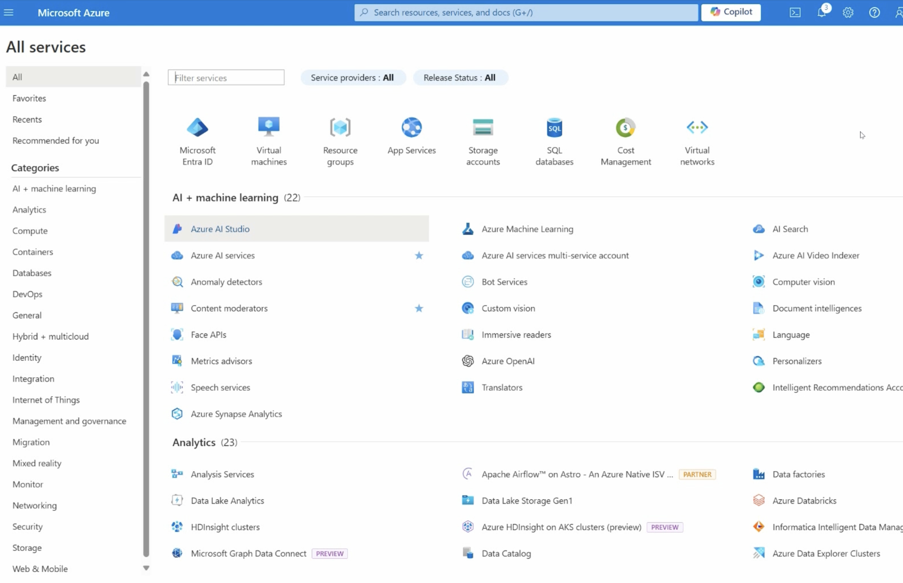
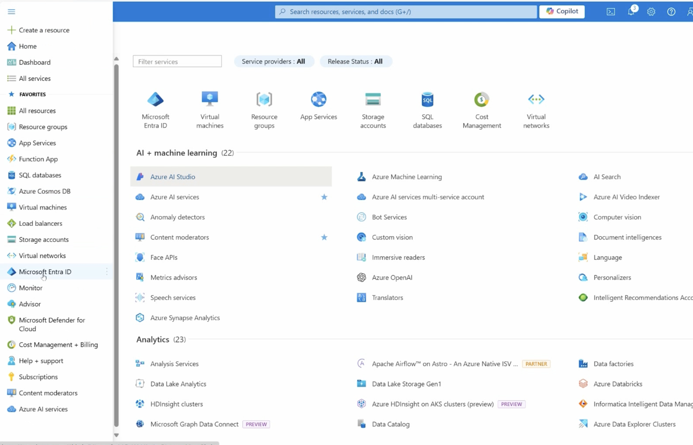
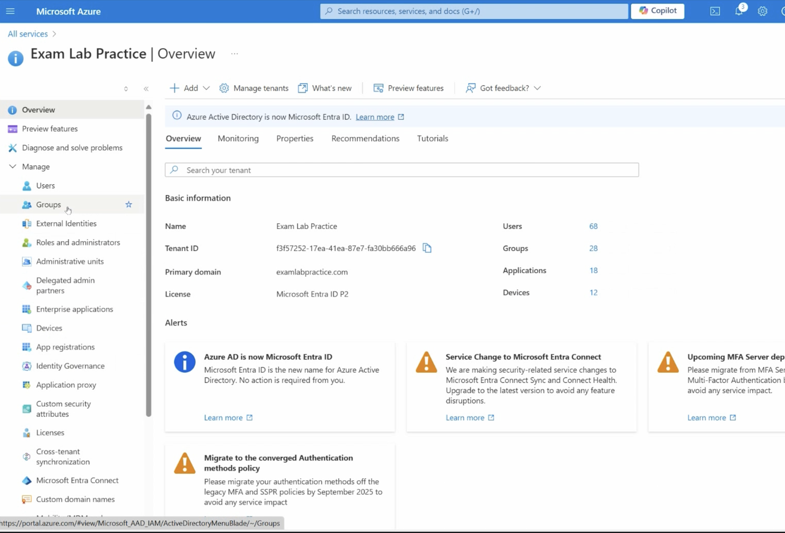
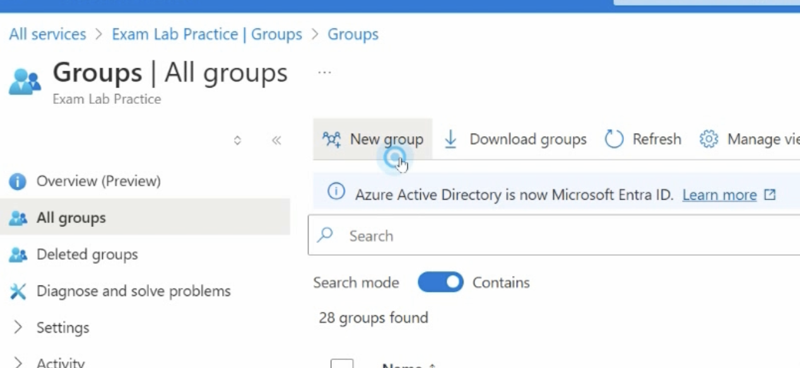
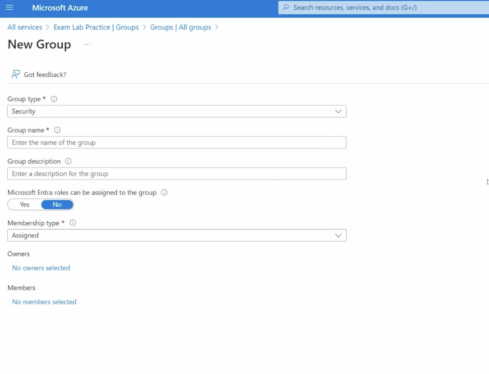
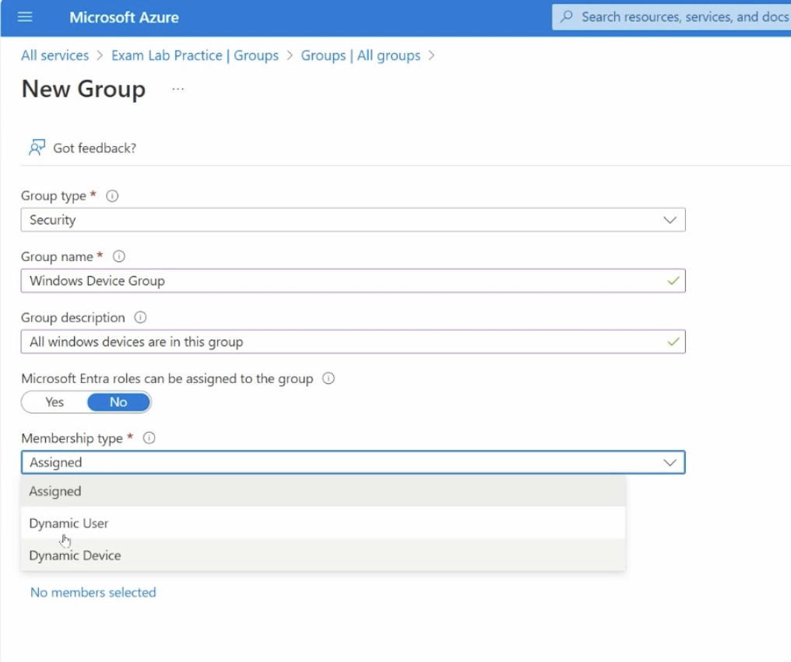
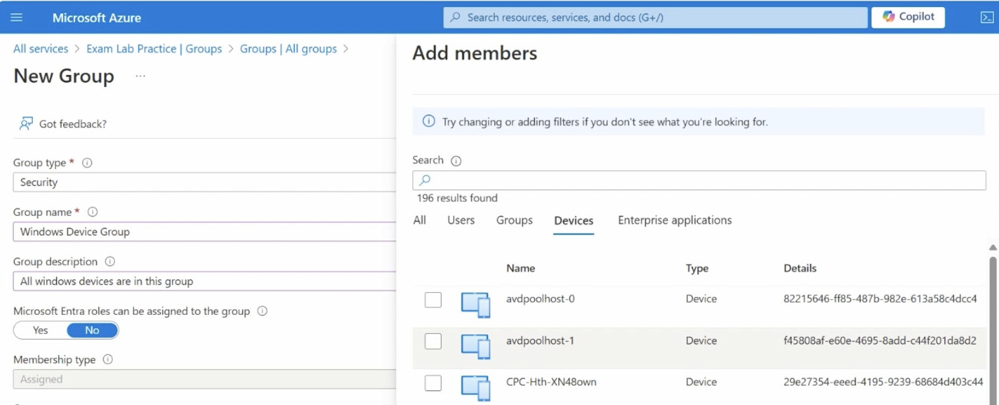
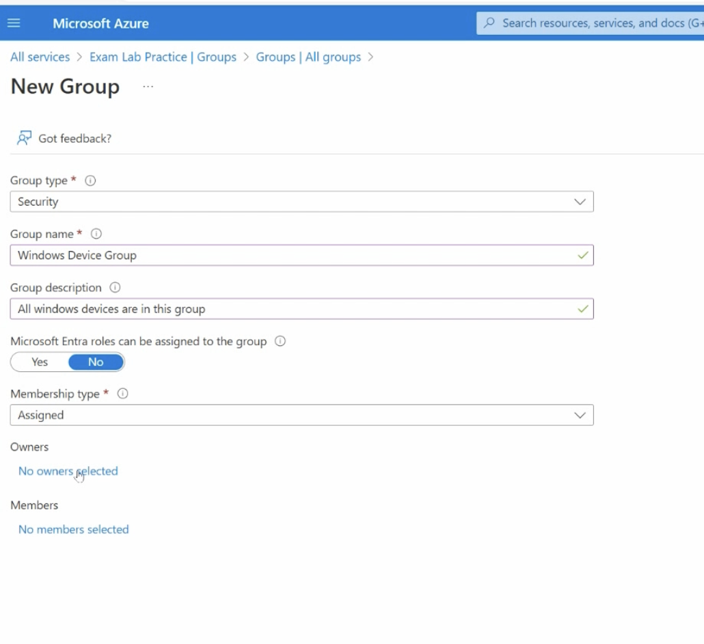
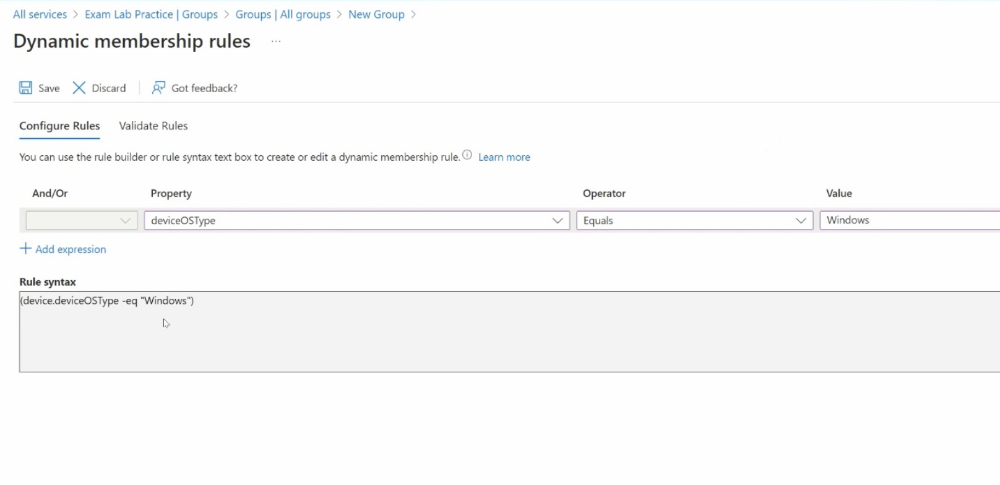
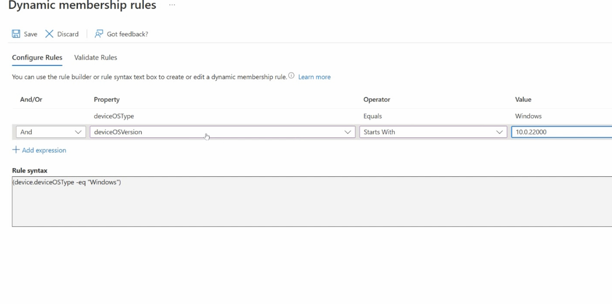

# MD-102 Endpoint Administrator Notes - Day 2
## Device Groups in Microsoft Entra ID

These notes are about creating and managing device groups in Microsoft Entra ID / Azure.

---

## What Are Device Groups?

In a company, we may have many different devices.

For example, a company may have 40 devices:

- 20 Windows 10 or Windows 11 devices
- Android devices
- iOS devices
- macOS devices
- Other device types

We can organize these devices into groups.

Device groups can be created based on:

- Department
- Operating system
- Operating system version
- Device type
- Device ownership
- Management type

For example:

- All Windows Devices
- All Windows 11 Devices
- All Android Devices
- Sales Department Devices
- Lab Computers
- Company-Owned Devices

Device groups are useful because we can assign policies, apps, updates, and settings to a group instead of managing each device one by one.

---

## Opening Groups in Microsoft Entra ID

To create a group in Microsoft Entra ID:

1. Open the Microsoft Azure portal.
2. Click the menu.
3. Go to Microsoft Entra ID.
4. Under Manage, select Groups.
5. Click New Group.

When the goal is to group devices, we should usually create a Security Group.

Important:

Do not choose Microsoft 365 Group when the goal is device management.

A Microsoft 365 Group is usually used for collaboration between users. For example, if we create a group for the Sales department, the users in that group may share Teams, Outlook, SharePoint, and other Microsoft 365 resources.

For device management, we should select:

Group type:
Security

Screenshot links:

---

## Creating a Group for Windows Devices

Now imagine we want to create a group for all Windows devices.

When creating the group, we need to enter the group information, such as:

- Group type
- Group name
- Group description
- Membership type

Since we are creating a group for devices, we should not select Dynamic User.

We usually choose one of these membership types:

- Assigned
- Dynamic Device

Assigned means we manually add devices to the group.

Dynamic Device means devices are added automatically based on rules.

There is also an Owner section. The owner of the group can manage the group. For example, the owner may be able to add or remove devices, depending on the group type and permissions.

In simple words:

Owner = the person responsible for managing the group.

Screenshot links:

---

## Assigned vs Dynamic Device Membership

If we select Assigned, we can manually add devices to the group.

If we select Dynamic Device, we cannot manually add devices to the group. Instead, we must use a Dynamic Query.

A Dynamic Query is a rule or condition.

Azure checks devices automatically. If a device matches the rule, Azure adds it to the group automatically.

Example:

If the rule says the device OS type must be Windows, then every Windows device will automatically become a member of that group.

This is useful because we do not need to manually add or remove devices.

---

## What Is a Dynamic Query?

A Dynamic Query is made of three main parts:

Property + Operator + Value

Property:
The device information we want to check.

Operator:
How we want to compare the property.

Value:
The value we want to match.

Example:

Property:
deviceOSType

Operator:
Equals

Value:
Windows

Meaning:

If the device OS type equals Windows, add the device to this group.

---

## What Are Properties?

Properties are pieces of information about a device.

For example:

- Device name
- Device OS type
- Device OS version
- Device ownership
- Management type
- Enrollment profile name

When we create a dynamic query, the Property section asks:

Which device information should Azure check?

For example, if we choose DeviceOSType, Azure checks the operating system type of each device.

In this lab, I selected:

Property:
DeviceOSType

Operator:
Equals

Value:
Windows

This means:

Add devices to this group if their operating system type is Windows.

After selecting the property, operator, and value, Azure automatically creates the rule syntax in the Rule Syntax box. We do not need to manually type the syntax.

If we wanted to create a group for Android devices, we could change the value to:

Android

Example:

Property:
DeviceOSType

Operator:
Equals

Value:
Android

This would create a dynamic group for Android devices.

Tip:

If you are not sure what a property means, click Learn More on the page to read Microsoft's explanation.

Screenshot link:

---

## Adding Another Expression

We can make the rule more specific by clicking Add Expression.

When adding another expression, we can choose:

- And
- Or

And means both conditions must be true.

Or means at least one condition must be true.

Example:

First condition:

Property:
DeviceOSType

Operator:
Equals

Value:
Windows

Second condition:

Property:
DeviceOSVersion

Operator:
Starts with

Value:
10.0.22000

This means:

Add the device to the group only if:

1. The device OS type is Windows.
2. The device OS version starts with 10.0.22000.

The version 10.0.22000 is related to Windows 11.

So this rule can be used to create a dynamic group for Windows 11 devices.

After adding the rule, click Save.

Screenshot link:

---

## My Lab Choice

In my lab, I did not add the second condition.

I only wanted to create a group for all Windows devices, not only Windows 11 devices.

So I used this condition:

DeviceOSType equals Windows

After saving the dynamic query, I clicked Create to create the group.

---

## Checking the Created Group

After creating the group:

1. Go back to the Groups page.
2. Use the search bar.
3. Search for Windows.
4. Select the group that was created.
5. Click Members.
6. Review the devices that were automatically added to the group.

The Members page shows all devices that match the dynamic query and became members of the group.

Screenshot links:

---

## Very Short Step Summary

1. Open Microsoft Entra ID.
2. Go to Groups.
3. Click New Group.
4. Select Security as the group type.
5. Enter the group name and description.
6. Choose the membership type.
7. Use Assigned for manual membership.
8. Use Dynamic Device for automatic device membership.
9. Click Add Dynamic Query.
10. Choose a property.
11. Choose an operator.
12. Enter a value.
13. Save the rule.
14. Create the group.
15. Open the group.
16. Check Members to see which devices were added.
