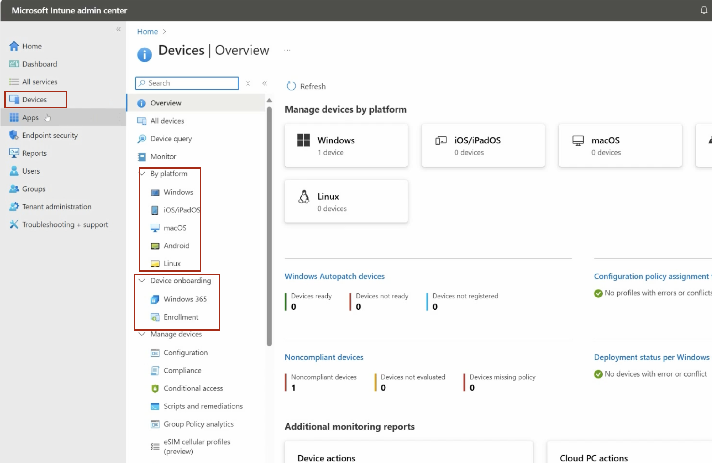

# MD-102 Endpoint Administrator Notes - Day 3

## Microsoft Intune Device Enrollment and Management

Today’s topic is Microsoft Intune and how organizations add and manage devices.

Microsoft Intune is a cloud-based endpoint management platform. It can be used to manage different types of devices, including:

- Windows computers
- macOS devices
- Android devices
- iPhones and iPads

Microsoft previously used the name Microsoft Endpoint Manager for the combined management platform that included Intune and Configuration Manager. The current cloud management portal is called the Microsoft Intune admin center.

## Devices Overview

When you sign in to:

https://intune.microsoft.com

you can select **Devices** from the navigation menu.

This section shows the devices that are connected to and managed by Intune.

Under **By platform**, devices can be viewed based on their operating system, such as Windows, Android, iOS/iPadOS, and macOS.

One important thing to remember is that Microsoft frequently changes the layout and navigation of its admin portals. The location or name of some options may be different in the future.

The more experience you gain with the platform, the easier it becomes to adapt to these interface changes.

## Device Onboarding

Inside the Devices section, there is an area called **Device onboarding**.

In the current interface, this area includes options such as:

- Enrollment
- Windows 365

These options are used for different purposes.

## Enrollment

Enrollment determines how devices are registered with Intune so that the organization can manage them.

There are several possible enrollment methods.

### Automatic Intune Enrollment

An organization can configure Windows devices to automatically enroll in Intune when they are joined to Microsoft Entra ID.

The basic process is:

Microsoft Entra ID Join
→ Automatic Intune Enrollment
→ Device management through Intune

Automatic enrollment can be enabled for all users or only selected groups of users.

### Windows Autopilot Enrollment

Devices prepared through Windows Autopilot can also be automatically enrolled in Intune.

Windows Autopilot is commonly used for new company-owned devices.

The organization registers the device with Windows Autopilot and assigns an Autopilot deployment profile to it.

When the employee turns on the device and connects it to the internet, the device can:

- Display the organization’s sign-in experience
- Join Microsoft Entra ID
- Enroll in Intune
- Receive company applications
- Receive configuration and security policies

The basic process is:

Windows Autopilot
→ Microsoft Entra ID Join
→ Intune Enrollment
→ Applications and policies are applied

### BYOD Enrollment

BYOD stands for Bring Your Own Device.

This means that an employee uses a personally owned device to access company resources.

A personal device may be enrolled through methods such as:

- Adding a work or school account
- Using the Company Portal application

If the organization allows personal device enrollment, the device can be registered with Intune and receive the required management or security settings.

Organizations can also configure enrollment restrictions to control:

- Which users are allowed to enroll devices
- Which operating systems are allowed
- Whether personally owned devices are allowed
- How many devices each user can enroll

## Windows 365

The Windows 365 section is related to creating and managing Cloud PCs.

A Cloud PC is a Windows computer that runs in Microsoft’s cloud instead of directly on the employee’s physical device.

The employee connects to the Cloud PC through the internet and sees a separate Windows desktop environment.

It is similar to opening a virtual machine in a window, but the Windows environment is running in Microsoft’s cloud rather than on the employee’s local computer.

Organizations may use Windows 365 to provide employees with secure and centrally managed work environments.

## Windows 365 Provisioning Policies

A Windows 365 provisioning policy defines how Cloud PCs should be created.

For example, the administrator can configure:

- Which Windows image should be used
- How the Cloud PC should join Microsoft Entra ID
- Which network connection should be used
- Which users should receive a Cloud PC
- How the Cloud PC should be configured during deployment

The provisioning policy is then assigned to a user group.

Users generally need both:

- Membership in the assigned group
- An appropriate Windows 365 license

When both conditions are met, a Cloud PC can be provisioned for that user.

The basic process is:

Create a Windows 365 provisioning policy
→ Assign the policy to a user group
→ Confirm that users have Windows 365 licenses
→ A dedicated Cloud PC is created for each eligible user

After the Cloud PC is created, it appears as a Windows device in Intune.

The administrator can then manage it by deploying:

- Applications
- Configuration policies
- Compliance policies
- Security settings
- Updates

## Screenshot

## Additional Day 3 Notes

More notes about Intune application management, configuration policies, compliance, and device security will be added below.
