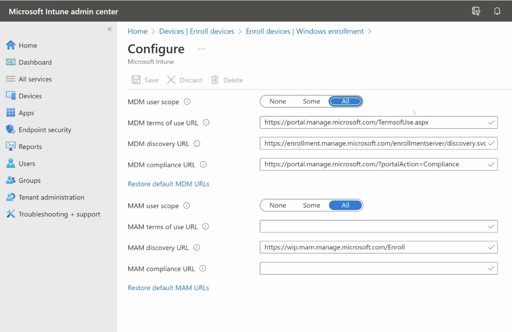
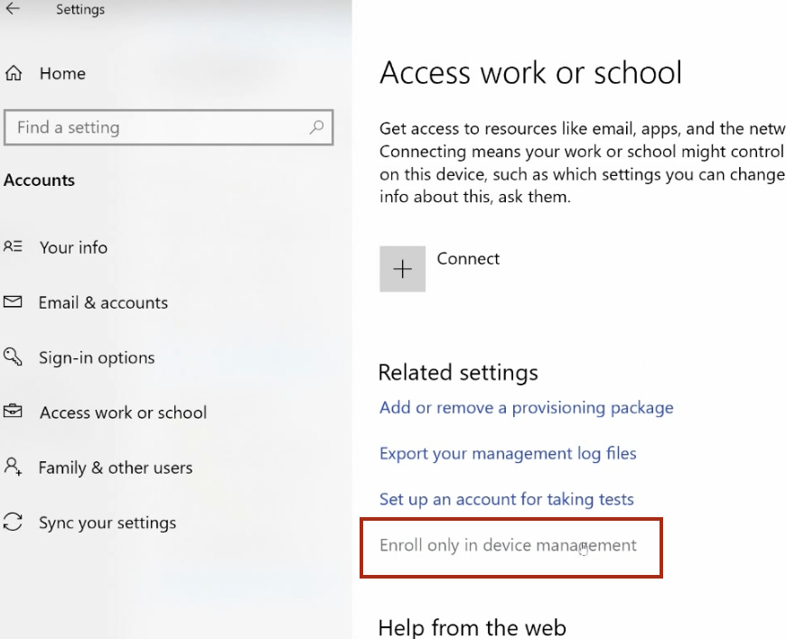
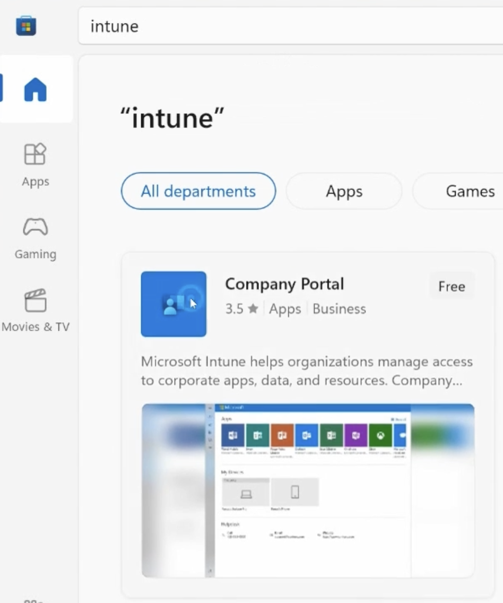
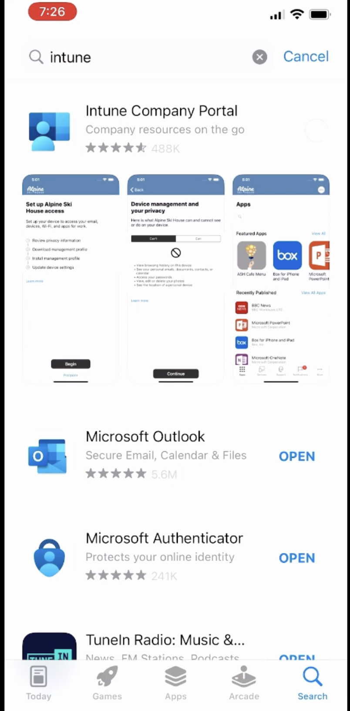
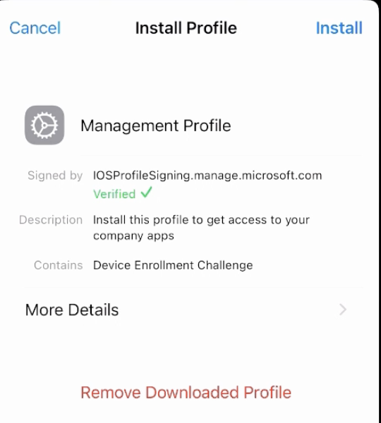
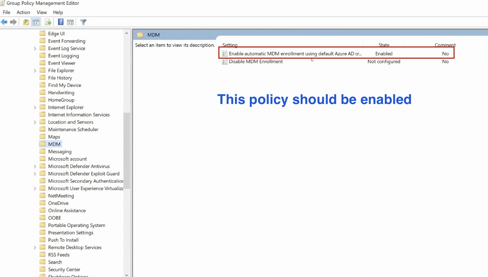
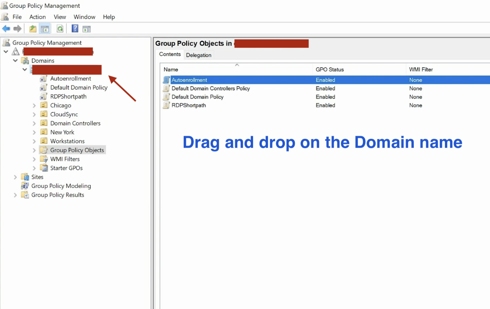
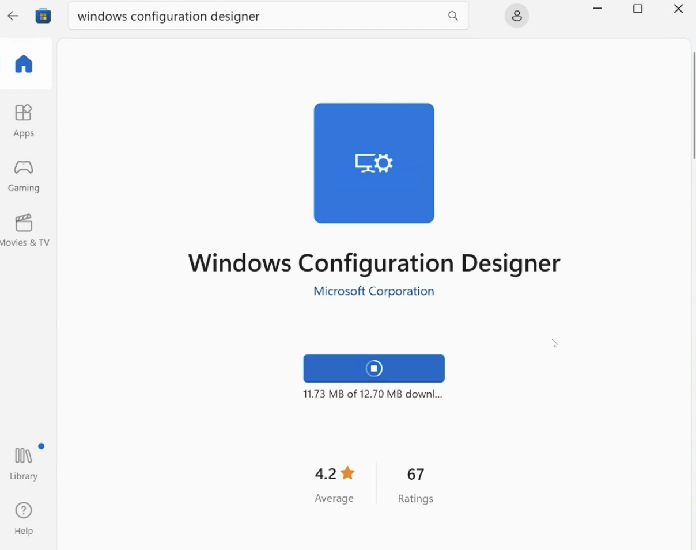
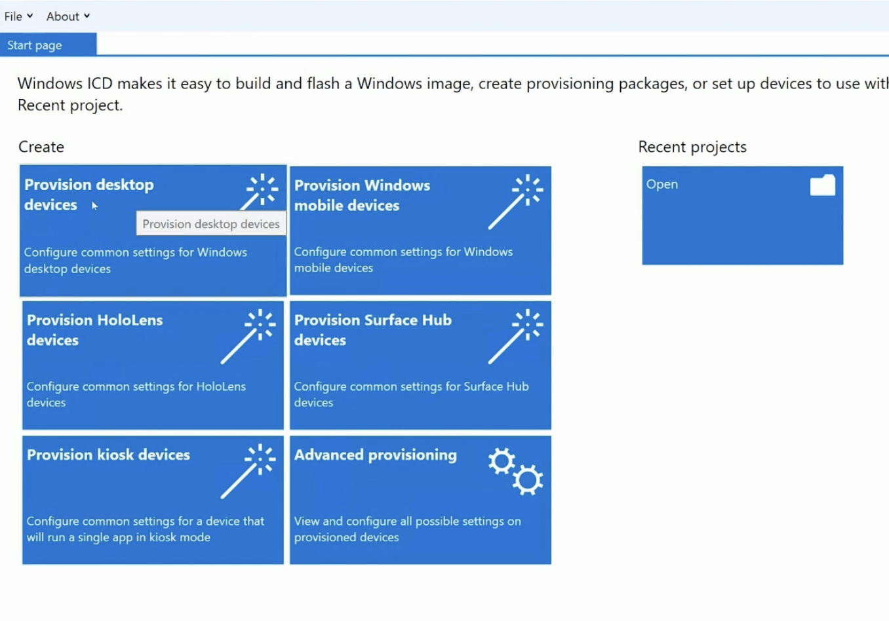

# MD-102 Endpoint Administrator Notes - Day 4

## Windows and Mobile Device Enrollment in Microsoft Intune

From now on, I want to keep my notes shorter and focus more on hands-on practice in Windows environments.

I also plan to record practical labs and upload them to my YouTube portfolio.

---

# Windows Intune Enrollment

## Automatic Enrollment

If Automatic Enrollment is enabled in Intune and the MDM user scope is set to All, a user can add their work account in Windows.

Path:

Settings > Accounts > Access work or school > Connect

The device can then automatically enroll in Intune.

---

## Manual Enrollment

If Automatic Enrollment is not enabled, adding a work account may only register the device with Microsoft Entra ID.

One manual Intune enrollment method is:

Settings > Accounts > Access work or school > Connect > Enroll only in device management

---

## Company Portal Enrollment

Another manual enrollment method is installing Microsoft Intune Company Portal from the Microsoft Store.

The user signs in with their work account and completes the enrollment process.

---

## Enrollment Through Microsoft 365 Applications

When signing in to Microsoft 365 applications with a work account, Windows may ask whether the organization should manage the device.

If the user accepts, the device may be registered with Microsoft Entra ID and enrolled in Intune, depending on the organization's configuration.

---

# Apple Enrollment

Before enrolling Apple devices, the Apple MDM Push Certificate must be configured in Intune.

After that:

1. Install Intune Company Portal from the App Store.
2. Sign in with the work account.
3. Follow the enrollment instructions.
4. Download the management profile.

Install the management profile from:

Settings > General > VPN & Device Management > Management Profile > Install

After installation, the iPhone should appear in the Devices section of Intune.

---

# Android Enrollment

Android enrollment is similar to Apple enrollment.

The user normally installs Intune Company Portal, signs in with a work account, and follows the enrollment instructions.

Android Enterprise must first be connected to Managed Google Play in Intune.

---

# Automatic and Bulk Enrollment

## Scenario 1: Hybrid Active Directory Environment

In this scenario, the organization has:

- On-premises Active Directory
- Microsoft Entra ID
- Hybrid Microsoft Entra joined devices
- Microsoft Intune

A Group Policy can be used to automatically enroll supported domain-joined Windows devices in Intune.

Group Policy path:

Server Manager
> Tools
> Group Policy Management
> Group Policy Objects
> Create a new GPO
> Edit
> Computer Configuration
> Policies
> Administrative Templates
> Windows Components
> MDM

Enable this policy:

Enable automatic MDM enrollment using default Microsoft Entra credentials

After creating the GPO, link it to the correct domain or Organizational Unit.

Important:

The devices must also be correctly configured for Hybrid Microsoft Entra Join and the users must have the required Intune licenses.

---

## Scenario 2: Bulk Enrollment Without a Hybrid Environment

In a non-hybrid environment, Windows Configuration Designer can be used to create a provisioning package.

Provisioning packages use the `.ppkg` file format.

General process:

Windows Configuration Designer
> Provision desktop devices
> Create a provisioning package
> Configure the required settings
> Export the `.ppkg` file
> Run the package on each device

A provisioning package can be used to:

- Connect devices to Microsoft Entra ID
- Enroll devices in Intune
- Configure device settings
- Add certificates
- Configure Wi-Fi
- Install applications
- Apply organization-specific settings

Windows Configuration Designer can be installed from the Microsoft Store.

Important:

A provisioning package makes bulk setup faster, but the package normally still needs to be applied to each device.

For modern large-scale Windows deployment, Windows Autopilot is often a better option.
